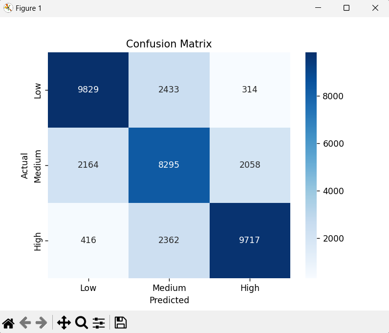
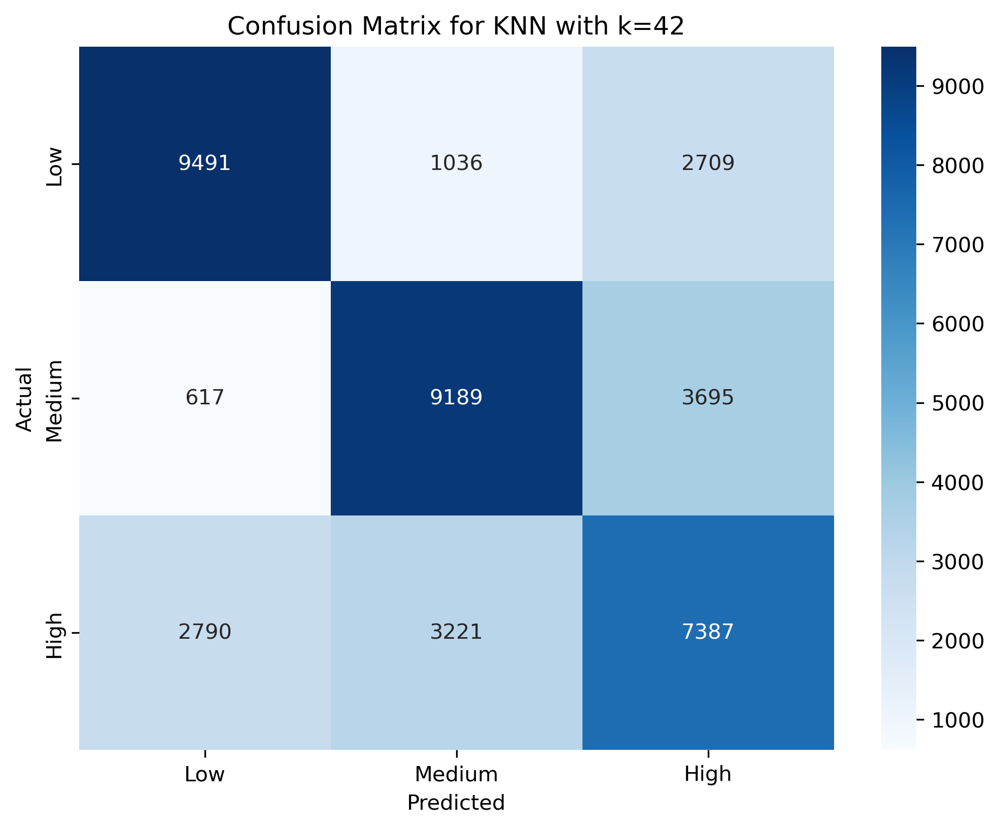
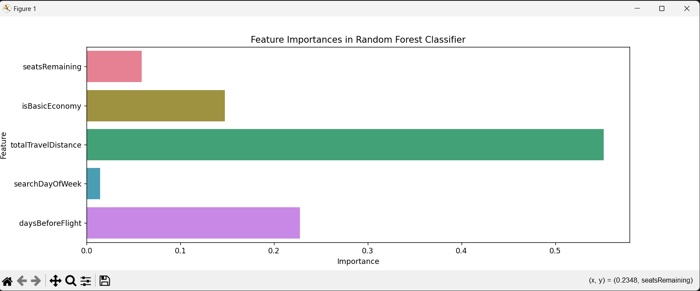
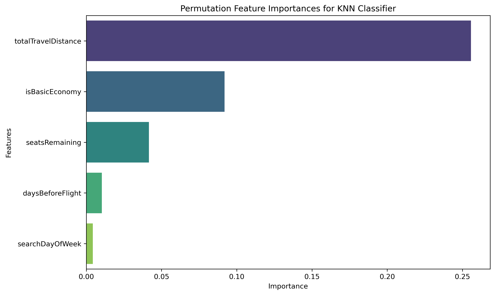
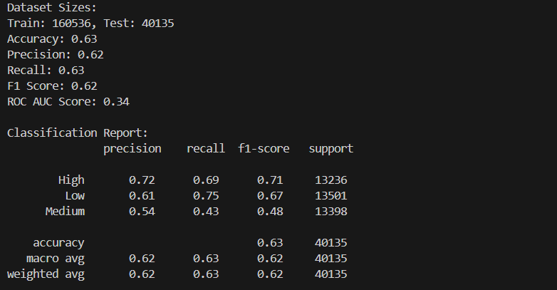

# CMPE_255_Final_Project

## Description
This repository contains the source code, results, and documentation for the **CMPE 255: Flight Prices Classification Project**. Our project aims to predict flight price ranges using machine learning models. Airline ticket prices are known to fluctuate frequently due to a combination of factors, including demand, seat availability, and seasonality. By classifying flight prices into predefined categories (low, medium, and high), we help provide insights into ticket pricing trends and support decision-making for consumers and businesses.

The models implemented include **Random Forest**, **Decision Trees**, and **K-Nearest Neighbors (KNN)**. Each model was tuned and evaluated to determine the best-performing algorithm for this classification task. Feature engineering was a key aspect of the project, where derived features such as `daysBeforeFlight`, `isWeekend`, and `isBasicEconomy` were crucial in influencing the models' predictions. Preprocessed data from Kaggle was used, containing extensive details about flights, including starting and destination airports, base fares, and seat availability.

Our experiments revealed that Random Forest provided the highest accuracy (74%), followed by Decision Trees (73%) and KNN (65%). Various evaluation metrics such as accuracy, precision, recall, and F1 score were used to measure the models' performance. The results indicate that Random Forest outperformed the other models due to its ability to handle mixed data types and minimize overfitting. This project highlights the importance of feature engineering and model tuning in achieving robust classification results.

---

## Visual Outputs
Below are the visual outputs generated during the project:

### Confusion Matrices
- 
- 

### Feature Importance Plots
- 
- 

### KNN Permutation Feature Importance
- 

### Additional Results
- 

---

## Setup Instructions
Follow these steps to set up the project on your local machine:

First, clone the repository to your local machine, then run the following commands:
```bash
git clone https://github.com/vipvivek15/CMPE_255_Final_Project.git
cd CMPE_255_Final_Project

python -m venv env

source env/bin/activate
env\Scripts\activate

pip install -r requirements.txt

python random_forest_flight_prediction.py
python decision_tree_classification.py
python knn_prediction.py
```
After running the models, the results (e.g., confusion matrices, feature importance plots) will be generated in the project directory. Use the .png files for visual insights into the model performances.
## Contributors
Vivek Ponnala, Hoai An Nguyen, Maggie Qin

